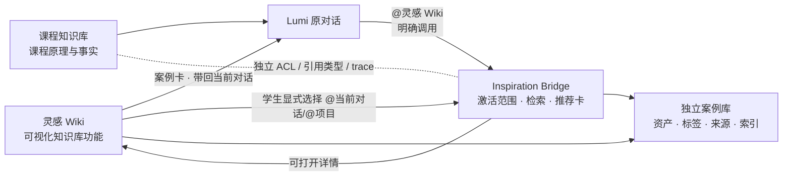
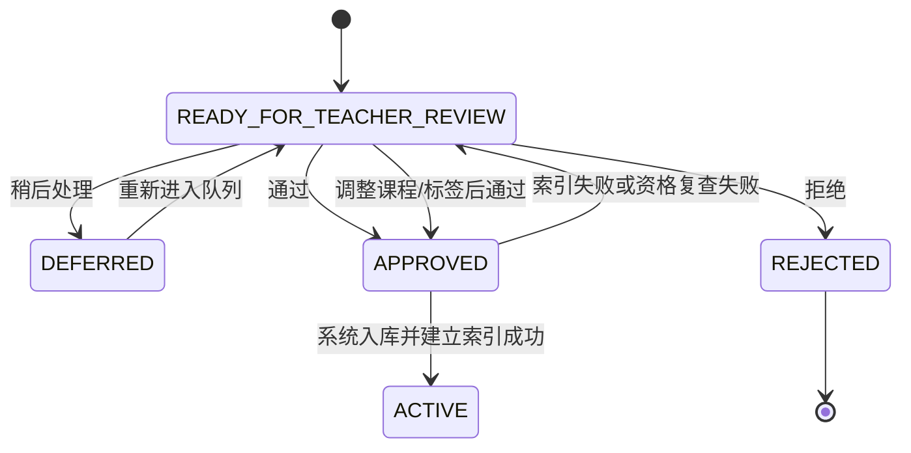

# Lumi 灵感 Wiki应用内模式：UX、Bridge 与审核队列契约

> 状态：IMPLEMENTATION_SLICE + FUTURE_INTERFACE_CONTRACT / 不部署 / 不读取真实学生数据或凭证
>
> 日期：2026-08-09
>
> 本文替代“学生离开 Lumi 打开独立 `/inspiration` 网站”的产品心智；兼容路由可以保留，但只重定向回 Lumi 学生工作台。

## 1. 术语与边界

- **灵感 Wiki**：Lumi 内的可视化知识库功能。它提供默认浏览、筛选、自然语言搜索、详情、来源、会话内收藏与“带回当前对话”；它不是 tool invocation，也不需要先说话才能浏览。
- **`@灵感 Wiki`**：学生在原 Lumi 对话、或未来被批准的创作/绘画入口中明确调用正式灵感 Wiki 的检索/推荐通道。它有独立的检索 trace 与推荐卡，不与课程或网页 citation 混用；单个案例不是回答证据。
- **Inspiration Bridge**：Browser 与 `@灵感 Wiki` 共享同一案例、标签、资产、来源与索引投影的双向接口层；不是第三个学生页面。
- **课程知识库**：仍独立负责课程原理与事实支持。它不能因同一入口、同一 case 或同一查询而继承 Wiki 的展示或引用权限。

## 2. 学生 UX 状态流

| 状态 | 入口与默认界面 | 可见信息 | 可执行动作 | 当前实现 |
| --- | --- | --- | --- | --- |
| `BROWSE_DEFAULT` | Lumi 固定导航的“灵感 Wiki”；主内容区直接展示已策展案例流 | 合规案例卡、主题筛选、标签、来源摘要、详情 | 滚动浏览、筛选、打开详情、会话内收藏、带回对话 | 已接入认证 `GET /api/inspiration/browse`；仅 candidate/admission 均 `ACTIVE` 且正式学生发布门全部明确通过的案例。明确登记且派生预览获准的本地 synthetic fixture 可由受保护预览端点显示，其他记录保持安全缺图状态。 |
| `SEARCH_INTENT` | 在 Browser 搜索框输入自然语言或关键词 | 已识别的受控 facet、排序后的匹配卡及原有筛选 | 继续细化、清空、打开详情、带回对话 | 已接入存储元数据的确定性轻搜索（书籍/版式/品牌/交互/色彩）；不是模型理解或外部检索 |
| `CONTEXT_ASSISTED_SEARCH` | Browser 中学生主动选择“使用当前对话找参考” | 被引用的当前对话对象、可见摘要边界 | 基于最小摘要推荐、移除上下文、返回默认浏览 | 已接入 owner-checked `THREAD` ContextRef；只摘要自己选择的对话末尾最多 4 条用户消息，不扫描或列举其它私聊 |
| `CHAT_MENTION` | 原对话输入明确写 `@灵感 Wiki` | 独立的灵感检索事件、推荐卡、`trace` | 打开 Browser 详情、带入/移除当前对话上下文、继续追问 | 已接入显式 parser、Bridge intent router 与 `inspirationCaseCards[]`；未写 @ 的普通对话不会查询正式 Wiki |

### 2.1 Browser 的最小交互

1. 学生登录后从 Lumi 固定导航进入 `BROWSE_DEFAULT`；不触发对话、检索或上下文读取。
2. 卡片流是第一屏。筛选和搜索增强它，不替代它；真实规模时需在受控 browse API 后使用分页、连续加载或虚拟化，不能把全部资产塞进客户端。
3. 点击卡片在同一应用壳查看详情、来源、许可提示、标签和已审核观察。返回列表不应重置当前筛选或滚动位置。
4. “加入当前画板”目前明确标为**本次 Lumi 会话收藏，未写入账户**；真实私有灵感板须在 owner/删除/保留期契约落地后启用。
5. “带回当前对话”返回原聊天，并以**对话上下文卡**呈现案例；它不会被错误渲染成课程或网页 citation。学生可一键发出带案例标题、关联理由和“不要直接复刻”边界的讨论请求。

### 2.2 Browser 的上下文辅助搜索（后续）

上下文选择器只能列出当前学生有权访问的对象，例如 `CURRENT_THREAD`、本人 `TASK`、本人 `THREAD`。用户必须主动点选；界面始终显示已选 chip、来源标题、范围说明与移除操作。没有点选时，Bridge 只能使用当前 Browser 查询，不得读取任何其他对话。

## 3. API、数据与权限契约

以下最小接口均为同一登录态下的受控服务端入口。

| 接口 | 输入 | 服务端必须做的事 | 输出边界 |
| --- | --- | --- | --- |
| `GET /api/inspiration/browse` | `cursor`、`limit`、`q`、受控主题 | cookie 认证后仍从 DB 复核用户存在及角色；仅 candidate/admission 均 `ACTIVE`，且 publication scope、studentVisible、展示/来源披露/教学/安全/质量决定、撤下准备度与 Browser/Bridge 通道全部通过 | 统一安全投影后的公开哈希案例 ID、标题/标签/课程关联、可展示来源/署名；无 candidate ID、原件、内部备注、私有 locator、签名 URL |
| `POST /api/inspiration/context-summary` | 用户主动提交 `{ type: "THREAD", threadId }` | 重新按 owner 校验 thread；只投影最近最多 4 条自己的短消息，限长 640 字 | `ContextSummary`，不含完整私聊、附件或其它会话枚举 |
| `POST /api/inspiration/bridge` | 当前消息、可选的显式 `THREAD` ContextRef | 仅 `@灵感 Wiki` 标记把正式 Wiki 作为检索范围；重新校验 ContextRef；课程与 Wiki 分别路由、trace 与降级 | 独立 `inspirationCaseCards[]` 推荐结果；课程与网页 citation 不混入 |

当前 `ContextRef` 最小形状为 `{ type: "THREAD", threadId }`。`threadId` 只作服务端查找，客户端不可提交任意摘要、他人会话或未验证的 case metadata 来替代授权校验。服务端将对象投影成限长、去附件/私密字段的 `ContextSummary`；不将整段私聊、学生注记或上传图写入检索 trace。

正式 Wiki 的 Browser、Preview 与 Bridge 使用同一 DB-backed viewer scope 和正式发布合取谓词；cookie 角色不能替代已持久化的用户存在性与角色。任一发布门、身份或安全投影失败均不透露候选身份；Bridge 返回空推荐结果而不降级成课程或网页检索。学生 metadata 只从显式公开字段投影，公开链接还须是无凭据/敏感 query 的 HTTPS，且精确命中该来源的审核域名白名单；无法证明时显示“来源未知”且不输出链接。

## 4. `@灵感 Wiki` 与课程通道

`@灵感 Wiki` 是显式意图，不是 Browser 的别名：

1. 原对话解析到 mention 后，仅向 Inspiration Bridge 请求案例；普通课程问题不因存在 Browser 而自动召回案例。
2. 混合问题可并列查询，但课程证据只能进课程 citation、网页证据只能进网页 citation、正式 Wiki 的检索结果只能进灵感推荐卡；UI、trace 与失败文案均分型。
3. 对话卡打开的是 Lumi 内 Browser 详情；Browser 选中的案例则以“当前对话上下文卡”带回，不伪装为已被模型引用。
4. `lib/agent/inspiration-case-retriever.ts` 的兼容 V3 adapter 也会先检查显式 mention；它返回的内容语义为推荐而非证据。真实学生数据的正式路径使用 `POST /api/inspiration/bridge` 对 `ACTIVE` Browse projection 检索。

## 5. 教师端：灵感 Wiki 候选审核队列

教师工作台新增“灵感 Wiki 候选审核”窗口，而非采集或分析入口。它只读取已完成后台处理且状态为 `READY_FOR_TEACHER_REVIEW` 的候选；学生永远不可读取此队列。

每张候选卡最小显示：受控预览、来源与抓取/处理时间、AI 建议课程/知识节点、解释信号（教学相关性、风格/新颖性、多样性、重复风险）、受控标签、处理状态和可见性/许可摘要。不得显示原始私密 locator、供应商原始载荷、其他学生数据或将 AI 解释写成事实结论。

已接入 `GET /api/teacher/inspiration-candidates?limit=30` 与 `POST /api/teacher/inspiration-candidates/:id/decision`。写入只允许 `APPROVE`、`REJECT`、`DEFER`、受控 `courseTags`、说明、`expectedRevision`、幂等键，以及在 `APPROVE` 时可选的严格正式学生发布对象；服务端验证 DB-backed 教师身份、候选状态、版本并写入审核审计。教师工作台入口按需加载队列，展示 loading / empty / error / 409 冲突状态，且通过/拒绝采用可回滚的乐观更新。普通 `APPROVE` 只进入 `ACTIVE + INTERNAL_CATALOG_ONLY`，不会进入任何学生出口；只有教师逐项确认学生展示、来源披露、教学、安全、质量、撤下与双通道后，数据库才允许记录正式学生发布。`REJECTED` 绝不进入学生 Browser 或 Bridge。

`inspiration-case-intake` 与 P2 review pipeline 现已提供状态机、真实教师队列 API、审核审计、内部 admission 与独立正式学生发布门；前端仅使用仓库内合规 fixture 测试 API 契约。`GET /api/inspiration/previews/:publicId` 以无 candidate ID 的公开哈希引用派发 `no-store` 的同源预览，学生须同时通过完整正式发布谓词和 `DERIVE_PREVIEW=ALLOW`，教师额外只可读取 DB 判定仍可审核的候选；目前仅显式 `local-synthetic://` fixture 可交付字节，真实资产 resolver 仍是上线 Gate。

## 6. 本轮已实现与后续 Gate

已实现：

- `/student?inspiration=1` 在同一 Lumi 登录态、固定侧栏和原对话壳中打开全尺寸灵感 Wiki；默认就是可滚动的已策展案例流。
- 固定导航与欢迎入口都切入 app 内 mode；`/inspiration`、`/assistant-lab` 保留为兼容路由并回到 `/student`，不再呈现独立产品页面。
- 自然语言书籍/版式/品牌/交互/色彩搜索在本地 fixture 上转换为可见 facet 和排序；搜索状态不读取私人上下文。
- 教师工作台已有按需打开的真实候选审核队列，调用私有的教师 API；仅 `READY_FOR_TEACHER_REVIEW` 可审核。普通 `APPROVE` 完成内部入库/索引并进入 `ACTIVE + INTERNAL_CATALOG_ONLY`；另一个默认禁用的正式发布按钮要求全部学生门逐项显式确认。
- Browser 选择案例可带回当前对话作为独立上下文卡；显式 `@灵感 Wiki` 返回的是独立推荐卡，不会被渲染成课程或网页 citation。
- 学生页在序列化 Browser fixture 前执行服务器学生身份检查，避免匿名客户端接收案例元数据。
- Browser 默认从真实认证 API 读取，不再注入 fixture；fixture 仅在开发环境显式 `/student?inspiration=1&inspirationFixture=1` 或组件测试中使用。API 对每页的公开投影按激活时间与公开哈希 ID 稳定排序，支持游标继续浏览。

仍需在实际学生可见版本前完成：真实来源/合法资产 resolver（替换当前 local-synthetic 受控预览）、私有收藏 board API、规模增长后的虚拟化、可搜索的本人 thread 选择器与 `@` palette、访问性矩阵，以及 P0 台账的 G-01 至 G-09 对应签核。不得用本地 fixture、SHADOW 结果或 UI 入口替代这些 Gate。
